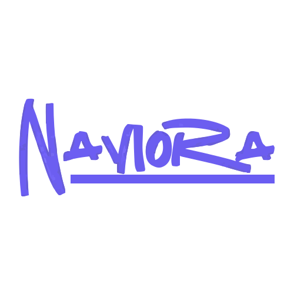

<div align="center">
  
  <h1 align="center">Naviora</h1>
  <p align="center">Plan together, travel smarter — a collaborative trip planner with real-time sync, interactive maps, and day‑based itineraries.</p>
  <p align="center">
    <a href="https://naviora-indol.vercel.app/" target="_blank"><strong>Live Demo →</strong></a>
  </p>
</div>

<br/>

## Tech Stack

- **Framework:** Next.js 16 (Turbopack, App Router)
- **Language:** TypeScript
- **Database:** PostgreSQL (Neon) + Prisma ORM
- **Auth:** Custom JWT (jose) + bcryptjs
- **Maps:** react-map-gl + Mapbox GL JS
- **Places:** Google Places API (New)
- **Real‑time:** Pusher
- **Email:** Resend
- **File uploads:** Uploadthing
- **Styling:** Tailwind CSS v4 + shadcn/ui (Base UI React)
- **State:** TanStack React Query
- **Forms:** react-hook-form + zod
- **Animations:** Framer Motion, GSAP

## Features

- Day‑based itinerary builder with drag‑to‑reorder places
- Collaborative trip planning — invite members via email
- Real‑time sync (Pusher) for places, days, and trip updates
- Interactive Mapbox map with route optimization
- Activity log with paginated history
- Push‑style notifications (bell icon, unread badge)
- Google OAuth sign‑in
- Email verification (Resend)
- Avatar upload (Uploadthing)

## Getting Started

```bash
pnpm install
cp .env.example .env   # fill in your env vars
npx prisma generate
pnpm dev
```

Open [http://localhost:3000](http://localhost:3000).

### OR

Build using Dockerfile

## Scripts

| Command                  | Description                  |
| ------------------------ | ---------------------------- |
| `pnpm dev`               | Start dev server (Turbopack) |
| `pnpm build`             | Production build             |
| `pnpm start`             | Start production server      |
| `pnpm test`              | Run Vitest tests             |
| `pnpm lint`              | ESLint                       |
| `npx prisma migrate dev` | Run database migrations      |

## License

MIT
